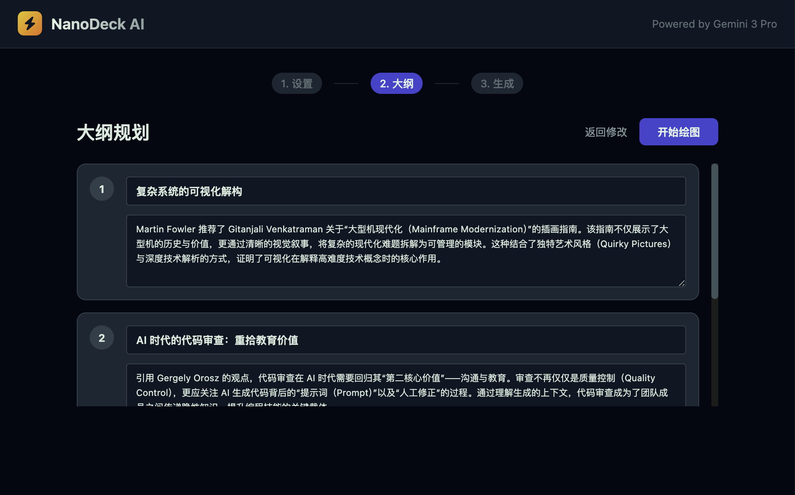
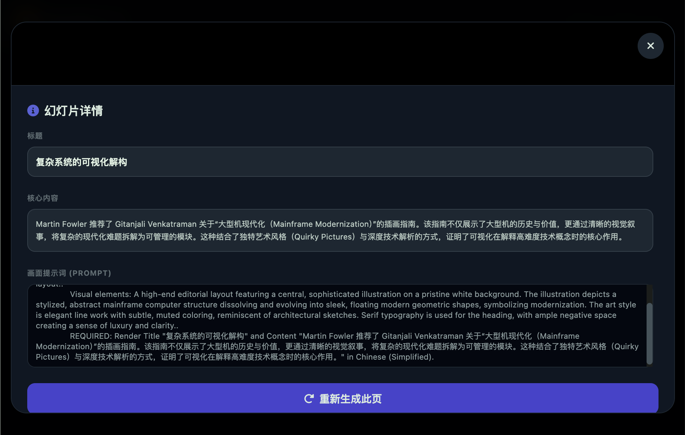

# NanoDeck AI - 幻灯侠 ⚡️

[English](#english) | [简体中文](#chinese)

<a name="english"></a>
## English

NanoDeck AI is a powerful presentation generator powered by Google's **Gemini 3 Pro (nano banana 3)**. It transforms text content or web links into visually stunning, structured presentation slides with high-quality AI-generated imagery.

### Why NanoDeck AI?
This project uses **Gemini 3 Pro (nano banana 3)** for image generation, overcoming several limitations found in NotebookLM's "Slide Deck" feature:
- **No Image Quantity Limits**: Generate as many slides as you need for your story.
- **Fully Editable Content**: Manually adjust outlines, slide text, and even the specific image prompts for every page.
- **Flexible Aspect Ratios**: Supports multiple formats including 16:9, 4:3, 1:1, 3:4, and 9:16.
- **Watermark-Free**: Professional, clean visual output suitable for any setting.
- **Core Style Customization**: Retains the ability to define and refine visual styles while providing more control over the final look.

### Use Cases
- **PPT Creation**: Rapidly turn rough notes or reports into professional decks.
- **Paper Interpretation**: Quickly interpret and visualize core concepts from academic papers.
- **Creative Works**: Generate picture books, comic strips, or visual narratives.

---

<a name="chinese"></a>
## 简体中文

NanoDeck AI 是一款基于 Google **Gemini 3 Pro (nano banana 3)** 的强力演示文稿生成工具。它可以将纯文本内容或网页链接转化为结构清晰、视觉精美的幻灯片。

### 项目初衷
本项目使用 **nano banana 3** (Gemini 3 Pro) 来生成图片，避开了 NotebookLM “演示文稿”功能中的诸多局限：
- **无图片数量限制**：不再受限于固定页数，满足长篇内容的呈现需求。
- **内容完全可编辑**：支持手动微调大纲、幻灯片正文，甚至可以单独修改每一页的绘图提示词（Prompt）。
- **比例灵活调整**：支持 16:9, 4:3, 1:1, 3:4, 9:16 等多种主流页面比例。
- **无水印干扰**：生成纯净、高质量的专业级视觉素材。
- **核心功能保留**：在提供更高自由度的同时，完整保留了风格自定义等核心 AI 创作功能。

### 应用场景
- **PPT 创作**：将工作报告、项目计划快速转化为演示文稿。
- **快速解读论文**：将晦涩的论文内容转化为易于理解的可视化大纲。
- **生成绘本或漫画**：利用 AI 强大的叙事能力，创作精美的画面连续剧。

---

## Screenshots / 系统截图

### 1. Configuration / 配置页


### 2. AI Planning / AI 深度规划


### 3. Outline Refinement / 大纲规划


### 4. Generation Preview / 生成预览


### 5. Slide Details & Editing / 幻灯片详情与编辑


---

## Prerequisites / 前提条件

- **Node.js**: Ensure you have Node.js installed on your machine.
- **Gemini API Key**: You need a valid API key from Google AI Studio.

## Installation / 安装步骤

1. **Install dependencies**:
   ```bash
   npm install
   ```

2. **Configure Environment**:
   Create a `.env.local` file in the root directory and set your Gemini API key:
   ```env
   GEMINI_API_KEY=your_gemini_api_key_here
   ```

3. **Run the app**:
   ```bash
   npm run dev
   ```